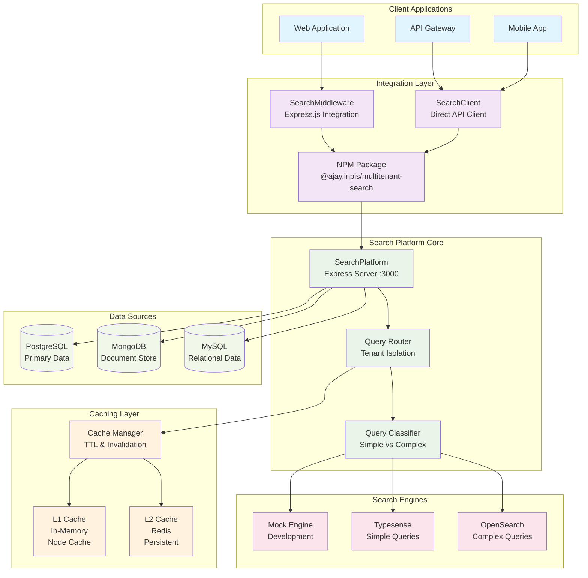

# @ajay.inpis/multitenant-search - Architecture Overview

## 🏗️ Complete System Architecture



## 🔄 Data Flow Architecture

```
┌─────────────────────────────────────────────────────────────────────────────────┐
│                           CLIENT REQUEST FLOW                                   │
└─────────────────────────────────────────────────────────────────────────────────┘

┌─────────────┐    ┌──────────────┐    ┌─────────────────┐    ┌─────────────────┐
│   Client    │───▶│    Express   │───▶│ SearchMiddleware│───▶│  SearchPlatform │
│ Application │    │ Application  │    │   Integration   │    │   (Port 3000)   │
└─────────────┘    └──────────────┘    └─────────────────┘    └─────────────────┘
                                                ▲                        │
                                                │                        ▼
                                                │              ┌─────────────────┐
                                                │              │  Tenant Router  │
                                                │              │ & Query Parser  │
                                                │              └─────────────────┘
                                                │                        │
                                                │                        ▼
                                                │              ┌─────────────────┐
                                                │              │  Cache Manager  │
                                                │              │   Check L1/L2   │
                                                │              └─────────────────┘
                                                │                        │
                                                │                 ┌──────▼──────┐
                                                │                 │             │
                                                │          ┌──────▼──────┐     │
                                                │          │ Cache Hit?  │     │
                                                │          │             │     │
                                                │          └──────┬──────┘     │
                                                │                 │            │
                                                │          ┌──────▼──────┐     │
                                                │          │    YES      │     │
                                                │          │ Return Data │     │
                                                └──────────┤             │     │
                                                           └─────────────┘     │
                                                                               │
                                                                        ┌──────▼──────┐
                                                                        │     NO      │
                                                                        │ Query Engine │
                                                                        └──────┬──────┘
                                                                               │
                                                            ┌──────────────────▼──────────────────┐
                                                            │          Query Classifier            │
                                                            │   Simple │ Complex │ Hybrid         │
                                                            └────┬─────┴─────┬───┴────┬───────────┘
                                                                 │           │        │
                                                        ┌────────▼─────┐ ┌───▼───┐ ┌─▼──────┐
                                                        │  Typesense   │ │OpenSearch│ │Combined│
                                                        │   Engine     │ │ Engine │ │ Query  │
                                                        └────────┬─────┘ └───┬───┘ └─┬──────┘
                                                                 │           │       │
                                                                 └───────────┼───────┘
                                                                             │
                                                                   ┌─────────▼─────────┐
                                                                   │   Cache Results   │
                                                                   │   L1 + L2 Store   │
                                                                   └─────────┬─────────┘
                                                                             │
                                                                   ┌─────────▼─────────┐
                                                                   │  Return Results   │
                                                                   │  to Application   │
                                                                   └───────────────────┘
```

## 🔧 Integration Patterns

### Pattern 1: Express Middleware Integration
```
┌─────────────────────────────────────────────────────────────────────────────────┐
│                        MIDDLEWARE INTEGRATION                                   │
└─────────────────────────────────────────────────────────────────────────────────┘

   Your Express App                     SearchMiddleware                Search Platform
┌─────────────────┐                  ┌─────────────────┐              ┌─────────────────┐
│                 │                  │                 │              │                 │
│ app.post(       │                  │  syncOnCreate() │              │   Data Sync     │
│   '/users',     │─────────────────▶│       +         │─────────────▶│   Background    │
│   middleware,   │                  │  Auto Extract   │              │   Processing    │
│   createUser    │                  │  Tenant ID      │              │                 │
│ );              │                  │                 │              │                 │
│                 │                  └─────────────────┘              └─────────────────┘
│ app.get(        │                  ┌─────────────────┐              ┌─────────────────┐
│   '/search',    │                  │                 │              │                 │
│   middleware    │─────────────────▶│    search()     │─────────────▶│  Query Engine   │
│ );              │                  │       +         │              │  L1/L2 Cache    │
│                 │                  │  Tenant Route   │              │  Results        │
└─────────────────┘                  └─────────────────┘              └─────────────────┘
```

### Pattern 2: Direct Client Integration
```
┌─────────────────────────────────────────────────────────────────────────────────┐
│                         CLIENT INTEGRATION                                     │
└─────────────────────────────────────────────────────────────────────────────────┘

   Your Application                     SearchClient                    Search Platform
┌─────────────────┐                  ┌─────────────────┐              ┌─────────────────┐
│                 │                  │                 │              │                 │
│ const client =  │                  │  HTTP Client    │              │   REST API      │
│ new SearchClient│─────────────────▶│  with Retry     │─────────────▶│   Endpoints     │
│ ({config});     │                  │  Logic          │              │                 │
│                 │                  │                 │              │                 │
│ const results = │                  │  - search()     │              │ POST /search    │
│ await client    │─────────────────▶│  - suggest()    │─────────────▶│ POST /suggest   │
│ .search(query); │                  │  - health()     │              │ GET  /health    │
│                 │                  │                 │              │                 │
└─────────────────┘                  └─────────────────┘              └─────────────────┘
```

## 🚀 Caching Strategy Deep Dive

```
┌─────────────────────────────────────────────────────────────────────────────────┐
│                           CACHING ARCHITECTURE                                 │
└─────────────────────────────────────────────────────────────────────────────────┘

                                    ┌─────────────────┐
                                    │  Search Query   │
                                    │  + Tenant ID    │
                                    └────────┬────────┘
                                             │
                                    ┌────────▼────────┐
                                    │  Generate Key   │
                                    │ "search:tenant: │
                                    │ query_hash"     │
                                    └────────┬────────┘
                                             │
                        ┌────────────────────▼────────────────────┐
                        │              L1 CACHE                   │
                        │         (In-Memory - Fast)              │
                        │  ┌─────────────────────────────────┐    │
                        │  │ Node Cache (LRU)                │    │
                        │  │ • 10,000 entries max           │    │
                        │  │ • 5 min TTL                    │    │
                        │  │ • ~50MB memory                 │    │
                        │  │ • Sub-millisecond access       │    │
                        │  └─────────────────────────────────┘    │
                        └────────┬────────────┬───────────────────┘
                                │ HIT        │ MISS
                                │            │
                       ┌────────▼────────┐   │
                       │  Return Data    │   │
                       │  (1-5ms)        │   │
                       └─────────────────┘   │
                                             │
                        ┌────────────────────▼────────────────────┐
                        │              L2 CACHE                   │
                        │         (Redis - Persistent)            │
                        │  ┌─────────────────────────────────┐    │
                        │  │ Redis Cache                     │    │
                        │  │ • 1M+ entries                  │    │
                        │  │ • 1 hour TTL                   │    │
                        │  │ • Network latency (~1-10ms)    │    │
                        │  │ • Shared across instances      │    │
                        │  └─────────────────────────────────┘    │
                        └────────┬────────────┬───────────────────┘
                                │ HIT        │ MISS
                                │            │
                       ┌────────▼────────┐   │
                       │  Store in L1    │   │
                       │  Return Data    │   │
                       │  (5-15ms)       │   │
                       └─────────────────┘   │
                                             │
                        ┌────────────────────▼────────────────────┐
                        │            SEARCH ENGINES               │
                        │                                         │
                        │  ┌─────────────┐  ┌─────────────────┐   │
                        │  │ Typesense   │  │   OpenSearch    │   │
                        │  │ (Simple)    │  │   (Complex)     │   │
                        │  │ ~20-50ms    │  │   ~50-200ms     │   │
                        │  └─────────────┘  └─────────────────┘   │
                        └────────┬────────────────────────────────┘
                                │
                       ┌────────▼────────┐
                       │ Store in L2+L1  │
                       │ Return Data     │
                       │ (20-200ms)      │
                       └─────────────────┘
```

## 🏢 Multi-Tenant Data Isolation

```
┌─────────────────────────────────────────────────────────────────────────────────┐
│                      TENANT ISOLATION ARCHITECTURE                             │
└─────────────────────────────────────────────────────────────────────────────────┘

┌─────────────┐    ┌─────────────┐    ┌─────────────┐
│   Tenant A  │    │   Tenant B  │    │   Tenant C  │
│   (acme)    │    │   (beta)    │    │  (gamma)    │
└──────┬──────┘    └──────┬──────┘    └──────┬──────┘
       │                  │                  │
       └──────────────────┼──────────────────┘
                          │
              ┌───────────▼───────────┐
              │    Request Router     │
              │   Extract Tenant ID   │
              │  (Header/JWT/Domain)  │
              └───────────┬───────────┘
                          │
              ┌───────────▼───────────┐
              │   Tenant Validator    │
              │  Check Permissions    │
              │   Rate Limiting       │
              └───────────┬───────────┘
                          │
         ┌────────────────┼────────────────┐
         │                │                │
    ┌────▼────┐      ┌────▼────┐      ┌────▼────┐
    │Cache A  │      │Cache B  │      │Cache C  │
    │Prefix:  │      │Prefix:  │      │Prefix:  │
    │acme:*   │      │beta:*   │      │gamma:*  │
    └────┬────┘      └────┬────┘      └────┬────┘
         │                │                │
    ┌────▼────┐      ┌────▼────┐      ┌────▼────┐
    │Index A  │      │Index B  │      │Index C  │
    │tenant_a │      │tenant_b │      │tenant_c │
    │filter   │      │filter   │      │filter   │
    └─────────┘      └─────────┘      └─────────┘
```

## 🔄 Data Synchronization Flow

```
┌─────────────────────────────────────────────────────────────────────────────────┐
│                        DATA SYNC ARCHITECTURE                                  │
└─────────────────────────────────────────────────────────────────────────────────┘

Your Application                 SearchMiddleware              Search Platform
┌───────────────┐              ┌──────────────────┐          ┌─────────────────┐
│               │              │                  │          │                 │
│ POST /users   │              │  syncOnCreate()  │          │                 │
│ {             │──────────────▶│       │         │          │   Background    │
│   name: "...", │              │       ▼         │──────────▶│   Data Sync     │
│   email:"..." │              │  Extract Data    │          │                 │
│ }             │              │  Add Tenant ID   │          │  ┌─────────────┐│
│               │              │  Transform Doc   │          │  │Queue Manager││
└───────────────┘              └──────────────────┘          │  │• Batch: 100 ││
        │                               │                    │  │• Retry: 3x  ││
        ▼                               │                    │  │• Async Ops  ││
┌───────────────┐                       │                    │  └─────────────┘│
│  201 Created  │◀──────────return──────┘                    │                 │
│  Response     │                                            │  ┌─────────────┐│
└───────────────┘                                            │  │Search Index ││
                                                             │  │• Typesense  ││
┌───────────────┐              ┌──────────────────┐          │  │• OpenSearch ││
│               │              │                  │          │  │• Update Doc ││
│ PUT /users/123│              │  syncOnUpdate()  │          │  └─────────────┘│
│ {             │──────────────▶│       │         │──────────▶│                 │
│   name: "...", │              │       ▼         │          │  ┌─────────────┐│
│   email:"..." │              │  Extract Data    │          │  │Cache Invalidate│
│ }             │              │  Add Tenant ID   │          │  │• Clear L1   ││
│               │              │  Transform Doc   │          │  │• Clear L2   ││
└───────────────┘              └──────────────────┘          │  │• Key Pattern││
        │                                                    │  └─────────────┘│
        ▼                                                    └─────────────────┘
┌───────────────┐
│  200 Updated  │
│  Response     │
└───────────────┘

┌───────────────┐              ┌──────────────────┐          ┌─────────────────┐
│               │              │                  │          │                 │
│DELETE /users/ │              │  syncOnDelete()  │          │                 │
│       123     │──────────────▶│       │         │──────────▶│   Remove Doc    │
│               │              │       ▼         │          │   from Index    │
│               │              │  Extract ID      │          │                 │
│               │              │  Add Tenant ID   │          │  ┌─────────────┐│
└───────────────┘              └──────────────────┘          │  │Search Index ││
        │                                                    │  │• Delete Doc ││
        ▼                                                    │  │• Update Stats│
┌───────────────┐                                            │  └─────────────┘│
│  204 Deleted  │                                            │                 │
│  Response     │                                            │  ┌─────────────┐│
└───────────────┘                                            │  │Cache Invalidate│
                                                             │  │• Clear Keys ││
                                                             │  └─────────────┘│
                                                             └─────────────────┘
```

## 📊 Performance Metrics

```
┌─────────────────────────────────────────────────────────────────────────────────┐
│                          PERFORMANCE CHARACTERISTICS                           │
└─────────────────────────────────────────────────────────────────────────────────┘

Response Times:
┌─────────────────┬─────────────┬─────────────┬─────────────┐
│   Cache Level   │    Hit %    │ Avg Time    │   Max QPS   │
├─────────────────┼─────────────┼─────────────┼─────────────┤
│ L1 Cache (Mem)  │    40-60%   │   1-5ms     │   10,000+   │
│ L2 Cache (Redis)│    25-35%   │   5-15ms    │   5,000+    │
│ Search Engine   │    10-35%   │  20-200ms   │   1,000+    │
└─────────────────┴─────────────┴─────────────┴─────────────┘

Memory Usage:
┌─────────────────┬─────────────┬─────────────┐
│   Component     │  Base RAM   │ Per 10K Docs│
├─────────────────┼─────────────┼─────────────┤
│ Search Platform │    50MB     │    +20MB    │
│ L1 Cache        │    10MB     │    +50MB    │
│ Node.js Runtime │    30MB     │     +5MB    │
└─────────────────┴─────────────┴─────────────┘

Scalability:
┌─────────────────┬─────────────┬─────────────┐
│   Metric        │   Single    │  Clustered  │
├─────────────────┼─────────────┼─────────────┤
│ Concurrent Users│    1,000    │   10,000+   │
│ Documents       │    1M       │    100M+    │
│ Tenants         │    100      │    10,000   │
└─────────────────┴─────────────┴─────────────┘
```

## 🛠️ Developer Integration Examples

### Quick Integration (5 minutes)
```javascript
// 1. Install package
// npm install @ajay.inpis/multitenant-search

// 2. Add to existing Express app
const { SearchMiddleware } = require('@ajay.inpis/multitenant-search');

const search = new SearchMiddleware({
  searchServiceUrl: 'http://localhost:3000'
});

// 3. Add to existing routes (no code changes needed!)
app.post('/api/users', search.syncOnCreate(), existingCreateUser);
app.get('/api/search', search.search());

// 4. Start search platform (separate process)
const { SearchPlatform } = require('@ajay.inpis/multitenant-search');
const platform = new SearchPlatform({ port: 3000 });
await platform.start();
```

### Advanced Integration
```javascript
// Custom configuration
const platform = new SearchPlatform({
  port: 3001,
  engines: {
    opensearch: { node: 'https://search.company.com' },
    redis: { host: 'redis.company.com' }
  },
  cache: {
    l1MaxSize: 50000,
    l1TtlMs: 600000,  // 10 minutes
    l2TtlMs: 3600000  // 1 hour
  }
});

// Custom data transformation
const middleware = new SearchMiddleware({
  searchServiceUrl: 'http://localhost:3001',
  transformDocument: (data, tenantId) => ({
    tenant_id: tenantId,
    title: data.name || data.title,
    content: `${data.description} ${data.tags?.join(' ')}`,
    category: data.category,
    created: data.createdAt
  })
});
```

This architecture provides:
- **🚀 High Performance**: Multi-level caching with intelligent invalidation
- **🔒 Multi-Tenant Security**: Complete data isolation per tenant
- **🔧 Easy Integration**: Multiple patterns for different use cases
- **📈 Scalable Design**: Horizontal scaling with Redis and clustered search
- **🛠️ Developer Friendly**: Minimal configuration required
- **📊 Production Ready**: Comprehensive monitoring and error handling